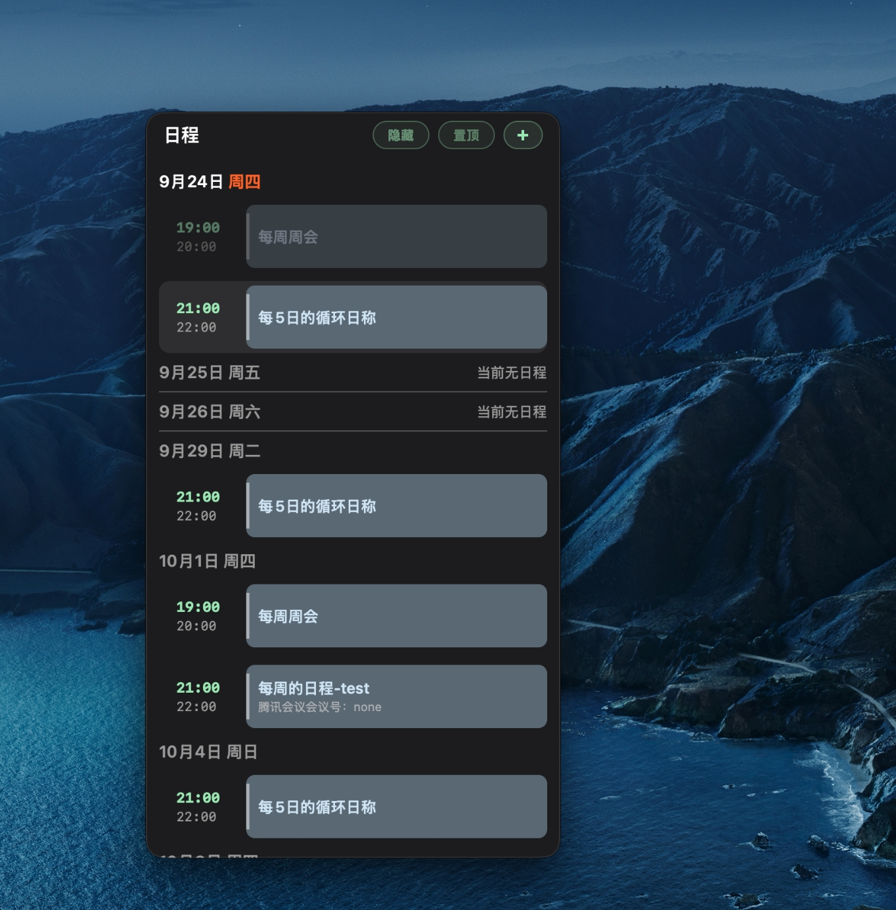
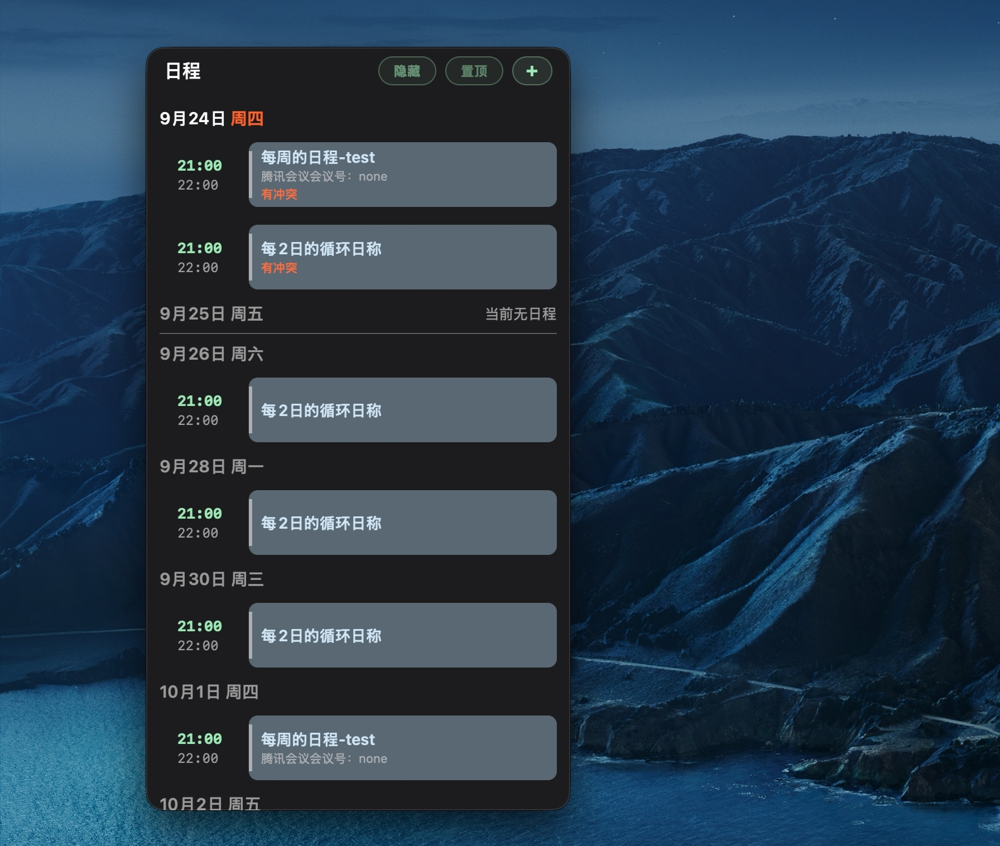
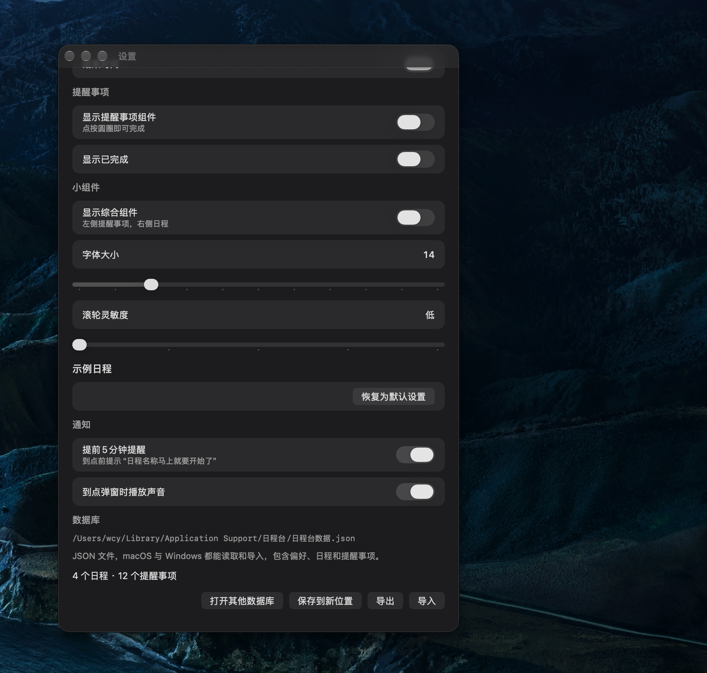

# 日程台

英文名：**Schedule Desk**

日程台是一个停在菜单栏里的 macOS 日程和提醒工具。它不出现在程序坞。小组件放在哪个桌面，就只留在那个桌面，切换屏幕时不会跟着走。

## 小组件

可以分别打开三个窗口：

- **日程**：按天列出日程。今天的日期和星期在最上面，星期用桔红色加粗。当天已经结束的日程仍会显示。往上滚可以看到更早的日子。
- **提醒事项**：未完成的在上面，已完成的在下面，中间有一条分隔线。圆圈用来勾选完成。
- **综合**：左边提醒事项，右边日程。

每个窗口右上角有「隐藏」「置顶」和添加按钮。隐藏会关掉这个窗口，并同步菜单和设置里的显示开关。置顶只影响当前这个窗口。

日程每一条都是圆角卡片。开始时间靠左、加粗，结束时间在它下面、颜色更淡。名称在右侧，备注用浅灰色小字写在名称下面。没有日程的日子会显示「当前无日程」。

时间重叠时，卡片上会用橙色标出「有冲突」。

## 新建和编辑

点「+」或双击已有的一条，打开编辑窗口。同一个按钮短时间连点，只会打开一个窗口；这条日程已经在编辑时，再次点击会把原来的窗口调到前面。

日程可以写名称、备注、全天、开始和结束时间。时间用滚轮选择：先点中某一列，指针停在这一列上时，滚轮才会改数字。重复可以选每天、每周、每月、每年，也可以自定义间隔、星期和截止日期。

提醒事项可以写名称、备注、提醒时间和优先级。

窗口左下角是「取消」和「删除」，右下角是「确认」，都是椭圆形磨砂按钮。编辑已有内容时才会出现「删除」。重复日程在删除时要再选一次：只删这一次，或删掉整组重复。

## 提醒

到点会弹出提醒，可以选择是否播放提示音。设置里可以打开「提前 5 分钟提醒」，默认是开的。开始前五分钟会提示「日程某某马上就要开始了」。

## 设置

设置窗口本身不置顶。

可以调整：

- 是否显示日程、提醒事项、综合组件
- 日程卡片、开始时间、结束时间的颜色
- 是否显示已完成的提醒事项
- 字体大小
- 滚轮灵敏度
- 提前 5 分钟提醒
- 到点是否播放声音

「恢复为默认设置」会关掉全部小组件。之后再打开某个开关，对应窗口会重新出现。

菜单栏里的「显示日程」「显示提醒事项」「显示综合组件」和设置里的开关是同一组。只有这三项会显示勾选状态。

## 数据

日程、提醒和偏好都写在一个 JSON 文件里，可以在 macOS 和 Windows 之间拷贝。设置里可以查看当前文件位置，也可以换位置、导出或导入。
